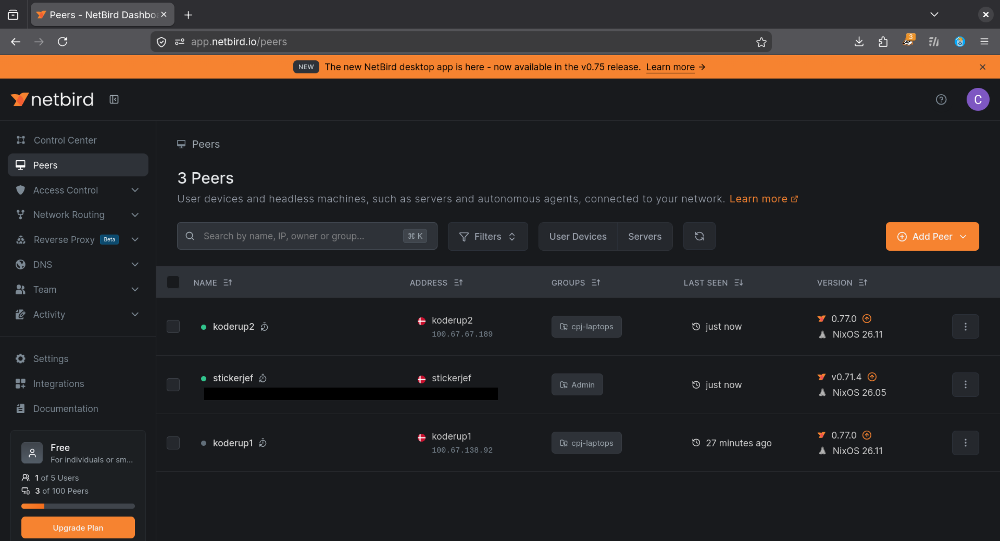
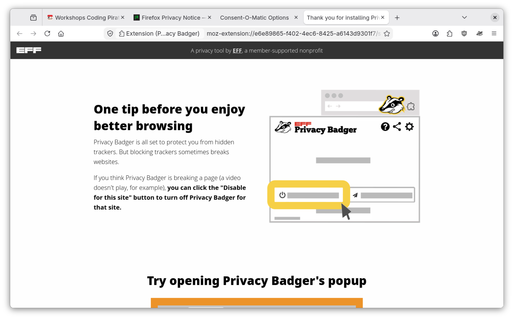
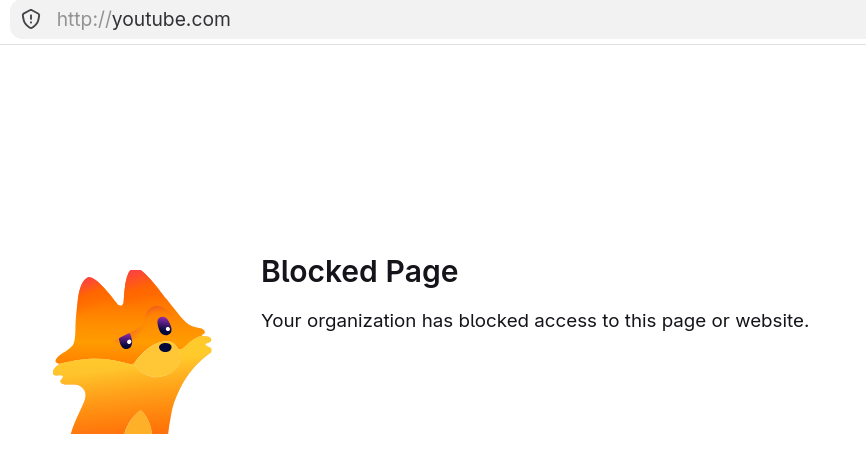

# cpj-laptops


## Docs

A reveal.js deck on NixOS for teaching laptops lives in [`slides/`](slides/).
Open [`slides/index.html`](slides/index.html) in a browser.
See [`slides/README.md`](slides/README.md) for navigation keys and how to copy the folder onto a web server.

```sh
firefox slides/index.html
```

## Administration

You need an SSH key and [netbird](#netbird) configured.

### Reconfiguring NixOS

The laptops should be connected to Netbird automatically.
Reconfigure it via:

```sh
nixos-rebuild switch --flake .#koderup1 --target-host root@koderup1.netbird.cloud
# or
just rebuild koderup1
```

#### Autoupgrade

Managed laptops also run `system.autoUpgrade` daily (around 17:30, with a random delay). They fetch `github:jensfriisnielsen/cpb-laptops` and `switch`.

Force an upgrade from the laptop:

```sh
su admin
sudo systemctl start nixos-upgrade.service
```

### Resetting laptops

The Dash (dock) defaults to Files, Terminal, Firefox, Brave, Chromium, Inkscape, and Krita. Users can pin extra apps or remove these.

Reset the Dash to that default list (as the logged-in user, or `sudo -u anon`):

```sh
dconf reset /org/gnome/shell/favorite-apps
```

The Dash should update immediately; no reboot. If it does not, check `dconf read /org/gnome/shell/favorite-apps`. Deleting `~/.config/dconf/user` also resets the Dash, but wipes other GNOME settings too.

### Installing NixOS (bootstrapping)

Following this guide for nixos-anywhere https://nix-community.github.io/nixos-anywhere/quickstart.html

The community installer image needs internet. On the administrator laptop, share WiFi over Ethernet first (see below), then install:

```sh
nix run github:nix-community/nixos-anywhere -- --extra-files nixos-anywhere-extra-files --flake .#koderup1 --target-host root@10.43.0.10
```

Replace `10.43.0.10` with the address in the DHCP leases file.

Hardware reports: most machines use the fleet `facter.json`. For a different chassis, generate into that host folder:

```sh
nix run github:nix-community/nixos-anywhere -- --generate-hardware-config nixos-facter ./hosts/koderup12/facter.json --extra-files nixos-anywhere-extra-files --flake .#koderup12 --target-host root@10.43.0.10
```

Optional NixOS settings for that machine go in `hosts/koderup12/default.nix` (a normal module). To reuse another host, symlink `facter.json` or `imports = [ ../koderup12 ];` from that host’s `default.nix`.

#### Share WiFi over Ethernet

Administrator laptop only (GNOME/NetworkManager). This does **not** change managed laptop configs.

`share-eth` adds a separate NetworkManager profile named `koderup-share` (DHCP + NAT on `10.43.0.1/24`). It does not modify `Wired connection 1` or any other profile. When the cable has link, that profile comes up and the installer laptop gets an address automatically.

```sh
nix run .#share-eth -- up
```

Plug Ethernet into the machine booting the NixOS community image. Watch for a lease:

```sh
nix run .#share-eth -- status
cat /var/lib/NetworkManager/dnsmasq-*.leases
```

Tear down when finished. This deletes `koderup-share`, removes the `KODERUP-SHARE` iptables/ip6tables chain, and restores the ethernet profile that was active before `up`:

```sh
nix run .#share-eth -- down
```

Override the NIC with `ETH=enp0s31f6` if auto-detect picks the wrong device. From `nix develop`, `share-eth up` / `share-eth down` work the same.

`down` is safe to run when sharing is already off. Do not wrap the whole command in `sudo`; the script prompts only for the firewall rules.

## Development

Enter the development environment

```sh
nix develop
```

### Secrets

Unlock the git-crypt encrypted secrets required for nixos-anywhere

```sh
make unlock
```

Edit sops secrets required for reconfiguring nixos

```sh
sops secrets.yaml
```
netbird-setup-key is required to connect to netbird in order to be able to provision NixOS over SSH

Note:
id_ed25519 SSH keys was used to generate the laptop age keys required on the laptop for sops activation decryption.

### HashedPasswords

```sh
nix-shell -p mkpasswd --run 'echo -n "yourpassword" | mkpasswd -s' | tr -d '\n'
```

## Laptops

### Users

anon is the default (configured autologin)

There is also admin with sudo.
Ask for the password.

### Software

Check [`configuration.nix`](configuration.nix) under `environment.systemPackages`.
Find available packages on [search.nixos.org](https://search.nixos.org/packages?channel=unstable)

#### Netbird

Laptops come preconfigured with Wireguard networking ("VPN") based on [netbird](https://netbird.io/)

Enroll your own device using Google as SSO.
Ask for the account.



#### Inkscape

Inkscape with extensions:

- [Ink/Stitch](https://inkstitch.org/)


### Browsers

Firefox and Brave are the classroom browsers: notion homepage, Qwant search, and a YouTube URL block.
They also get a locked **Classroom** bookmark folder (programmering.notion.site, pairdrop.net, editor.p5js.org, scratch.mit.edu, spike.legoeducation.com, makecode.microbit.org), defined in [`classroom-bookmarks.nix`](classroom-bookmarks.nix).
Chromium gets the same privacy extensions and that bookmark folder (`programs.chromium.extraOpts` applies to Chromium and Brave).
LibreWolf is unmanaged and still opens YouTube.



YouTube is blocked in the browser via policies, not via DNS or the firewall.
Toggle it by editing the lists in [`firefox.nix`](firefox.nix) (`WebsiteFilter`) and [`chromium.nix`](chromium.nix) (`URLBlocklist` in the Brave-only `classroom.json`).
`programs.chromium` writes policies to both Chromium and Brave, so homepage, search, and YouTube stay in `/etc/brave/policies/managed/classroom.json` instead of `extraOpts`.



Inspect after a rebuild (restart the browser): `about:policies` (Firefox), `brave://policy`, `chrome://policy`.

### LEGO SPIKE

Classroom robots use the official web app at [spike.legoeducation.com](https://spike.legoeducation.com/) (not Firefox — it needs Web Serial / Web Bluetooth).

- **USB (supported):** open the app in **Chromium** or **Brave**, plug in the hub, and pick it in the serial chooser. Student user `anon` is in `dialout`; LEGO USB devices get seat `uaccess` via [`spike.nix`](spike.nix).
- **Bluetooth (best-effort):** **Chromium only** (Brave has no Web Bluetooth). Pair in GNOME if needed. Chromium is started with `--enable-experimental-web-platform-features`; BlueZ runs with `Experimental = true`. Expect this to be flaky on Linux.
- Brave Shields are disabled for the SPIKE origin so the app can load. Shared Chromium/Brave policies allow Web Serial / WebUSB for LEGO vendor ID `1684` on that site — check `chrome://policy` / `brave://policy` after a rebuild.
- Chromium is pinned on the Dash for the Bluetooth path; USB also works from Brave.

If the app fails to load, privacy extensions (uBlock, Privacy Badger) may need an allowlist for that origin — leave them until a hub test shows a break.

### micro:bit

Classroom micro:bits use [makecode.microbit.org](https://makecode.microbit.org/) (also [python.microbit.org](https://python.microbit.org/)). Not Firefox — it has no WebUSB.

- **USB:** open the editor in **Chromium** or **Brave**, plug in with a data cable (not charge-only), and pick **BBC micro:bit CMSIS-DAP** in the WebUSB chooser. micro:bit USB devices get seat `uaccess` via [`microbit.nix`](microbit.nix) (vendor `0d28`). Student user `anon` is in `dialout` for `/dev/ttyACM*`.
- If the chooser says the device is already paired and in use, quit Chromium fully and connect again (or remove the device from the lock-icon USB list). That usually means the browser could not open the device until udev granted access.
- Unlike SPIKE, there is no Chromium enterprise WebUSB auto-allow for MakeCode — the site asks and the user picks the device.

### Speakers

Internal speakers stay off so classroom machines stay quiet. 3.5mm headphones, USB/Bluetooth headsets, and HDMI audio still work.

[`speakers.nix`](speakers.nix) tells WirePlumber to disable the ALSA UCM sink whose name matches `HiFi__Speaker__sink`.
On these ThinkPad T14s Gen 2a machines, speakers and headphones are two UCM devices on the same analog card (`Realtek ALC257`).
Disabling only that Speaker sink leaves the Headphones sink alone.

Do not mute the ALSA `Speaker` mixer from a boot script or timer. PipeWire then treats the whole HiFi profile as unavailable and GNOME shows **Dummy Output**, which also kills headphones.

With headphones plugged in, `wpctl status` (as the logged-in user) should list a Headphones sink, not Dummy Output.

