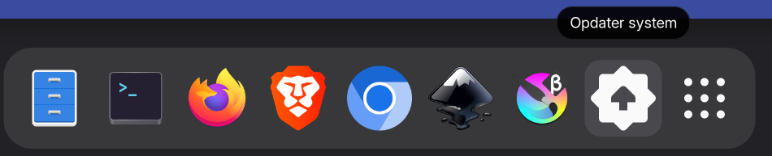
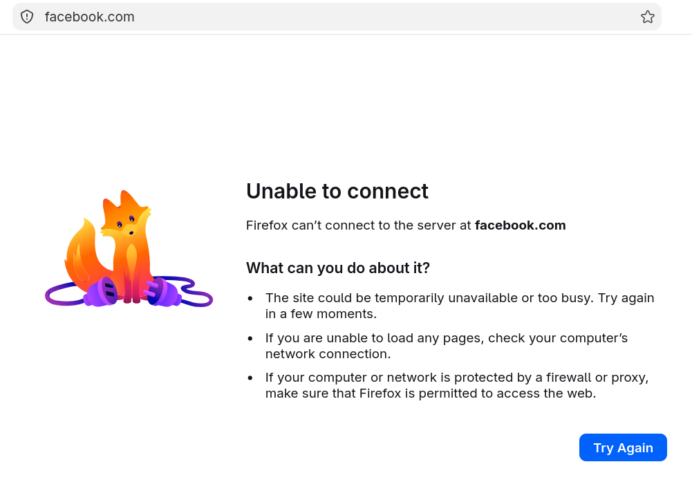

# cpj-laptops


## Docs

A reveal.js deck on NixOS for teaching laptops lives in [`slides/`](slides/).
Open [`slides/index.html`](slides/index.html) in a browser.
See [`slides/README.md`](slides/README.md) for navigation keys and how to copy the folder onto a web server.

```sh
firefox slides/index.html
```

## Administration

You need an SSH key and [netbird](#netbird) configured.

### Reconfiguring NixOS

The laptops should be connected to Netbird automatically.
Reconfigure it via:

```sh
nixos-rebuild switch --flake .#koderup1 --target-host root@koderup1.netbird.cloud
# or
just rebuild koderup1
```

#### Autoupgrade

Managed laptops also run `system.autoUpgrade` daily (around 17:30, with a random delay). They fetch `github:jensfriisnielsen/cpb-laptops` and `switch`.

Force an upgrade from the laptop:



- **Dash:** click **Opdater system** (last icon on the dock). GNOME Console opens, asks for the **Admin** password, runs `nixos-upgrade.service`, and shows the journal until you press Enter.
- **CLI:**

```sh
su admin
sudo systemctl start nixos-upgrade.service
```

Laptops that were set up before **Opdater system** was added to the default Dash need a one-time reset (as the logged-in user, or `sudo -u anon`):
This reset is now automatic with the system upgrade (but not when pushing `just rebuild`).

```sh
dconf reset /org/gnome/shell/favorite-apps
```

See [Resetting laptops](#resetting-laptops) for the full default Dash list.

### Resetting laptops

The Dash (dock) defaults to Files, Terminal, Firefox, Brave, Chromium, Inkscape, Krita, and **Opdater system**. Users can pin extra apps or remove these.

Reset the Dash to that default list (as the logged-in user, or `sudo -u anon`):

```sh
dconf reset /org/gnome/shell/favorite-apps
```

The Dash should update immediately; no reboot. If it does not, check `dconf read /org/gnome/shell/favorite-apps`. Deleting `~/.config/dconf/user` also resets the Dash, but wipes other GNOME settings too.

### Installing NixOS (bootstrapping)

Following this guide for nixos-anywhere https://nix-community.github.io/nixos-anywhere/quickstart.html

The community installer image needs internet. On the administrator laptop, share WiFi over Ethernet first (see below), then install:

```sh
nix run github:nix-community/nixos-anywhere -- --extra-files nixos-anywhere-extra-files --flake .#koderup1 --target-host root@10.43.0.10
# or
just provision koderup1 10.43.0.10
```

Replace `10.43.0.10` with the address in the DHCP leases file.

Hardware reports: most machines use the fleet `facter.json`. For a different chassis, generate into that host folder:

```sh
nix run github:nix-community/nixos-anywhere -- --generate-hardware-config nixos-facter ./hosts/koderup12/facter.json --extra-files nixos-anywhere-extra-files --flake .#koderup12 --target-host root@10.43.0.10
```

Optional NixOS settings for that machine go in `hosts/koderup12/default.nix` (a normal module). To reuse another host, symlink `facter.json` or `imports = [ ../koderup12 ];` from that host’s `default.nix`.

#### Share WiFi over Ethernet

Administrator laptop only (GNOME/NetworkManager). This does **not** change managed laptop configs.

`share-eth` adds a separate NetworkManager profile named `koderup-share` (DHCP + NAT on `10.43.0.1/24`). It does not modify `Wired connection 1` or any other profile. When the cable has link, that profile comes up and the installer laptop gets an address automatically.

```sh
nix run .#share-eth -- up
```

Plug Ethernet into the machine booting the NixOS community image. Watch for a lease:

```sh
nix run .#share-eth -- status
cat /var/lib/NetworkManager/dnsmasq-*.leases
```

Tear down when finished. This deletes `koderup-share`, removes the `KODERUP-SHARE` iptables/ip6tables chain, and restores the ethernet profile that was active before `up`:

```sh
nix run .#share-eth -- down
```

Override the NIC with `ETH=enp0s31f6` if auto-detect picks the wrong device. From `nix develop`, `share-eth up` / `share-eth down` work the same.

`down` is safe to run when sharing is already off. Do not wrap the whole command in `sudo`; the script prompts only for the firewall rules.

## Development

Enter the development environment

```sh
nix develop
```

### Secrets

Unlock the git-crypt encrypted secrets required for nixos-anywhere

```sh
make unlock
```

Edit sops secrets required for reconfiguring nixos

```sh
sops secrets.yaml
```
netbird-setup-key is required to connect to netbird in order to be able to provision NixOS over SSH

Note:
id_ed25519 SSH keys was used to generate the laptop age keys required on the laptop for sops activation decryption.

### HashedPasswords

```sh
nix-shell -p mkpasswd --run 'echo -n "yourpassword" | mkpasswd -s' | tr -d '\n'
```

## Laptops

### Users

anon is the default (configured autologin)

There is also admin with sudo.
Ask for the password.

#### GNOME Keyring

`anon` has an empty login password and GDM autologin, so PAM never unlocks a keyring. Without a default collection, apps prompt for a password for a new keyring.

[`modules/anon.nix`](modules/anon.nix) runs `anon-empty-keyring.service` before GDM. If (and only if) the files are missing, it creates an unencrypted default keyring at `~/.local/share/keyrings/Default_keyring.keyring` and a `default` pointer to that file. Existing keyring files are never deleted or rewritten, so autoupgrade cannot wipe secrets apps have stored.

The seed is not named `login.keyring`. GNOME Keyring re-encrypts that collection to the login password on write, which autologin never provides.

The keyring is stored unencrypted on disk. That matches this classroom account: empty password, autologin, no disk encryption.

Laptops that already have a passworded keyring keep prompting until it is removed. As `anon` (or `sudo -u anon`), after logging out or rebooting so the session can pick up a new default:

```sh
rm -f ~/.local/share/keyrings/login.keyring ~/.local/share/keyrings/default
# then reboot, or log out so autologin runs again
```

If `Default_keyring.keyring` is also missing after that, the next boot recreates the empty default. Do not delete `Default_keyring.keyring` if it already holds secrets you want to keep.

### WIFI

BAL-Internet is added as an automatic profile to NetworkManager.

### Software

Check [`modules/configuration.nix`](modules/configuration.nix) under `environment.systemPackages`.
Find available packages on [search.nixos.org](https://search.nixos.org/packages?channel=unstable)


#### Netbird

Laptops come preconfigured with Wireguard networking ("VPN") based on [netbird](https://netbird.io/)

Enroll your own device using Google as SSO.
Ask for the account.


#### Inkscape

Inkscape with extensions:

- [Ink/Stitch](https://inkstitch.org/)


### Browsers

Firefox and Brave are the classroom browsers: notion homepage, Qwant search, and a YouTube URL block.
They also get a locked **Pirater** bookmark folder (programmering.notion.site, pairdrop.net, editor.p5js.org, scratch.mit.edu, spike.legoeducation.com, makecode.microbit.org, github.com/jensfriisnielsen/cpb-laptops), defined in [`modules/classroom-bookmarks.nix`](modules/classroom-bookmarks.nix).
Chromium gets the same privacy extensions and that bookmark folder (`programs.chromium.extraOpts` applies to Chromium and Brave).
LibreWolf is unmanaged and still opens YouTube.


YouTube is blocked in the browser via policies, not via DNS or the firewall.
Toggle it by editing the lists in [`modules/firefox.nix`](modules/firefox.nix) (`WebsiteFilter`) and [`modules/chromium.nix`](modules/chromium.nix) (`URLBlocklist` in the Brave-only `classroom.json`).
`programs.chromium` writes policies to both Chromium and Brave, so homepage, search, and YouTube stay in `/etc/brave/policies/managed/classroom.json` instead of `extraOpts`.


Other sites are blocked fleet-wide via DNS in [`modules/dns-block.nix`](modules/dns-block.nix): each listed domain and its `www.` host are sinkholed in `/etc/hosts` (IPv4 and IPv6). Edit the `blockedDomains` list there to add or remove names. Firefox, Brave, and Chromium have DNS-over-HTTPS disabled so they use system DNS; LibreWolf is unmanaged and may still bypass via its own DoH.
After a rebuild, check with `getent hosts facebook.com` or `doggo facebook.com` (should resolve to `0.0.0.0` / `::`).



Inspect after a rebuild (restart the browser): `about:policies` (Firefox), `brave://policy`, `chrome://policy`.

### LEGO SPIKE

Use the official web app at [spike.legoeducation.com](https://spike.legoeducation.com/) in **Chromium** or **Brave**. Firefox cannot talk to the hub.

**On the laptop**

1. Open Chromium or Brave (Chromium is on the Dash).
2. Plug the hub in with a USB data cable (not charge-only).
3. In the app, connect and pick the hub in the serial chooser.
4. You can then download programs and update the hub’s own software (hub-styresystem).

Bluetooth is **Chromium only** (Brave has no Web Bluetooth) and often flaky on Linux. Pair in GNOME if you try it. Prefer USB. Chromium is started with `--enable-experimental-web-platform-features`; BlueZ runs with `Experimental = true`. Chromium is pinned on the Dash.

**If it does not work**

| What you see | What to try |
| --- | --- |
| The hub never appears in the chooser | Use Chromium or Brave, not Firefox. Unplug and plug the cable back in. Fully quit the browser (not just the tab) and open it again. |
| You pick the hub and nothing happens | Same as above. The laptop must be allowed to use the USB serial device; that is set up in [`modules/spike.nix`](modules/spike.nix). |
| Connect works, but updating the hub or sending a program fails (for example *“Der opstod en fejl under opdatering af hub-styresystem”*) | Unplug and plug the hub back in, stay on USB, and try again. The laptop now turns on DTR after the browser opens the port so the hub will answer; that used to fail in Chromium/Brave on Linux. |
| Connect worked, then the cable dropped and reconnect fails (`FILE_ERROR_IN_USE` or *ProgramFlowResponse was not acknowledged*) | Fully quit Chromium and connect again. Nothing else should keep `/dev/ttyACM*` open while the app is disconnected. |

**How the browser talks to the hub**

USB presents the hub as a virtual serial port (CDC ACM: `COM*` on Windows, `/dev/ttyACM*` on Linux). The web app uses the **Web Serial** API (Chromium/Brave only) at 115200 baud. Firefox has no Web Serial, so it cannot connect.

That one serial link carries two different languages:

- **Everyday use** (connect, run a Word Blocks / Python project) is LEGO’s binary hub protocol. The app sends framed packets and waits for replies such as `ProgramFlowResponse`.
- **Hub software update** (hub-styresystem) switches the same port into **MicroPython raw REPL**. The app sends Ctrl-C / Ctrl-A and waits a few seconds for the banner `raw REPL; CTRL-B to exit`, then uploads files through that REPL. If the banner never arrives, the update-error popup appears.

**DTR (Data Terminal Ready)** is a leftover modem control line on that serial port. Many STM32 USB-serial stacks (including SPIKE Prime) treat DTR as “a host is actually here”: they will accept USB writes with DTR off, but they will not send anything back. RTS is the matching “please send” line; we set both.

LEGO documents Chrome on **Chromebooks, Windows, and macOS**. Those systems assert DTR when the browser opens the port (Windows `CreateFile` on a COM port, macOS / ChromeOS serial open). The same Web Serial JavaScript therefore just works there: connect and REPL both see replies.

**Linux Chromium is different.** Opening `/dev/ttyACM*` and then applying Web Serial’s termios settings leaves DTR low. The chooser can succeed and the app can write Ctrl-A, but the hub stays silent, so REPL times out. [`modules/spike.nix`](modules/spike.nix) therefore:

- Grants **seat `uaccess`** on the LEGO USB device *and* the tty. Chromium’s sandbox drops the `dialout` group, so group membership alone is not enough; without the tty rule the chooser shows the hub but selecting it does nothing.
- Runs **`spike-serial-dtr`**, which finds Chromium/Brave’s existing file descriptor and turns DTR/RTS on. It must *not* keep its own open of the tty: that makes the kernel keep reading while the app is gone (stale packets, failed reconnect) and Chromium then logs `FILE_ERROR_IN_USE`.

Brave Shields are disabled for the SPIKE site so the app can load. Shared Chromium/Brave policies allow Web Serial / WebUSB for LEGO vendor ID `1684` on that site — check `chrome://policy` / `brave://policy` after a rebuild.

If the app page itself fails to load, privacy extensions (uBlock, Privacy Badger) may need an allowlist for that origin — leave them until a hub test shows a break.

### micro:bit

Classroom micro:bits use [makecode.microbit.org](https://makecode.microbit.org/) (also [python.microbit.org](https://python.microbit.org/)). Not Firefox — it has no WebUSB.

- **USB:** open the editor in **Chromium** or **Brave**, plug in with a data cable (not charge-only), and connect. micro:bit USB devices get seat `uaccess` via [`modules/microbit.nix`](modules/microbit.nix) (vendor `0d28`). Student user `anon` is in `dialout` for `/dev/ttyACM*`.
- If the chooser says the device is already paired and in use, quit Chromium fully and connect again (or remove the device from the lock-icon USB list). That usually means the browser could not open the device until udev granted access.
- Shared Chromium/Brave policies allow Web Serial / WebUSB for micro:bit vendor ID `3368` (`0d28`) on MakeCode and the Python editor — check `chrome://policy` / `brave://policy` after a rebuild. Connect may still open a chooser if the editor calls `requestDevice()`.

### Speakers

Internal speakers stay off so classroom machines stay quiet. 3.5mm headphones, USB/Bluetooth headsets, and HDMI audio still work.

[`modules/speakers.nix`](modules/speakers.nix) tells WirePlumber to disable the ALSA UCM sink whose name matches `HiFi__Speaker__sink`.
On these ThinkPad T14s Gen 2a machines, speakers and headphones are two UCM devices on the same analog card (`Realtek ALC257`).
Disabling only that Speaker sink leaves the Headphones sink alone.

Do not mute the ALSA `Speaker` mixer from a boot script or timer. PipeWire then treats the whole HiFi profile as unavailable and GNOME shows **Dummy Output**, which also kills headphones.

With headphones plugged in, `wpctl status` (as the logged-in user) should list a Headphones sink, not Dummy Output.

